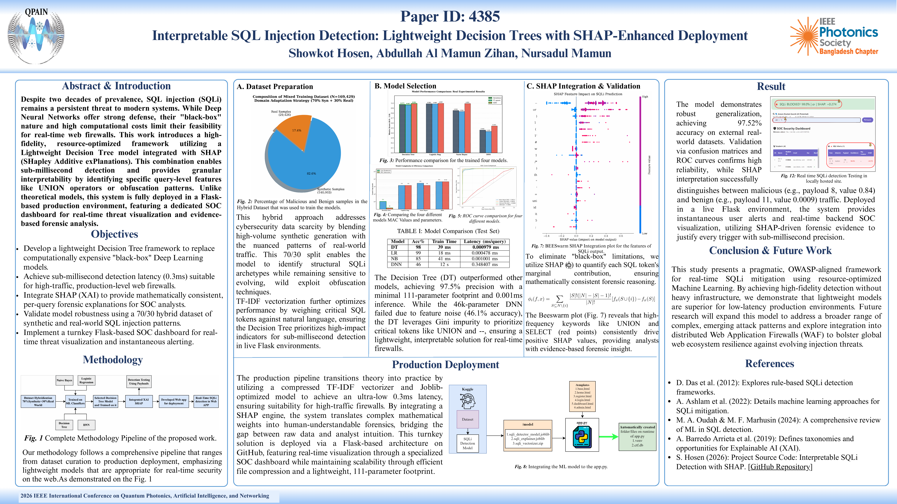

---


# Interpretable SQL Injection Detection: Lightweight Decision Trees with SHAP-Enhanced Deployment

This repository contains the official implementation of the research paper: **"Interpretable SQL Injection Detection: Lightweight Decision Trees with SHAP-Enhanced Deployment."**
<p align="center">
  
</p>
The project addresses the computational bottleneck of Deep Learning (DL) in web security by utilizing a high-performance **111-parameter Decision Tree** model, integrated with **SHAP (SHapley Additive exPlanations)** for real-time transparency in Security Operations Centers (SOC).

---

## 🔬 Research Overview

Traditional Deep Learning models for SQLi detection often exceed 45K parameters, leading to high latency in resource-constrained web environments. This implementation achieves:

* **Accuracy:** 98.31% on balanced hybrid datasets.
* **Latency:** ~0.3ms per query (production-grade).
* **Interpretability:** Query-level feature attribution via SHAP TreeExplainer.
* **Lightweight Design:** Only 111 model parameters compared to 46,000+ in standard DNNs.

---

## 🏗️ System Architecture

The pipeline consists of three core layers:

1. **Feature Engineering:** TF-IDF vectorization (max_features=15,000) to capture semantic SQL tokens.
2. **Detection Engine:** Optimized Decision Tree Classifier trained on 200K hybrid samples.
3. **Explainability Layer:** SHAP integration providing real-time "Red-Flag" token identification.
4. **Deployment Layer:** Flask-based Web Interface with SQLite-backed SOC alerting.

---

## 📁 Repository Structure

```text
├── Datasets/                 # Local data samples or placeholders
├── templates/                # HTML Interfaces (Search Bar & SOC Dashboard)
├── app.py                    # Flask Production Server
├── sqli_detector_model.joblib # Serialized (.joblib) Decision Tree Model
├── sqli_explainer.joblib      # Pre-computed SHAP Explainer
├── sqli_vectorizer.zip       # Compressed TF-IDF Vectorizer
├── requirements.txt          # Python Dependency Specification
├── Test Payloads.md          # Sample SQLi payloads for testing
└── README.md                 # Project Documentation & Reproducibility Guide

```

---

## 🚀 Reproducibility Guide

### 1. Environment Setup

```bash
# Clone the newly created repository
git clone https://github.com/Showkot-Hosen-10/SQLi-Interpretable-Detection.git
cd SQLi-Interpretable-Detection

# Create and activate virtual environment
python -m venv venv

# Activate on Windows:
venv\Scripts\activate
# Activate on macOS/Linux:
# source venv/bin/activate

# Install dependencies
pip install -r requirements.txt

```

### 2. Launching the System

```bash
python app.py

```

* **User Gateway:** `http://localhost:5000`
* **SOC Dashboard:** `http://localhost:5000/admin`

### 3. Verification Credentials

| Role | Username | Password |
| --- | --- | --- |
| **Admin/SOC Analyst** | `admin` | `admin123` |
| **End User** | `student` | `student123` |

---

## 📊 Evaluation Results

The model was validated against 15 unique real-world attack vectors, including Tautology, Union-based, and Time-Delay attacks.

| Metric | Decision Tree (Proposed) | DNN (Baseline) |
| --- | --- | --- |
| **Accuracy** | **98.0%** | 48% (Overfit/Poor Convergence) |
| **Parameters** | **111** | 46,849 |
| **Training Time** | **43ms** | 10s |
| **Inference Latency** | **0.001ms** | 0.133ms |

---

## 🛡️ Interpretability Case Study

When a payload like `1' OR 1=1 --` is detected, the SHAP engine decomposes the prediction:

* **Trigger Token `--**`: Contributes **+0.535** to the malicious score.
* **Trigger Token `OR**`: Contributes **+0.122** to the malicious score.
This allows security teams to verify the "logic" behind the alert instantly.

---

## 📜 Citation

If you use this code or research in your work, please cite:

```bibtex
@inproceedings{hosen2026sqli,
  author    = {Hosen, Showkot and others},
  title     = {Interpretable {SQL} Injection Detection: Lightweight Decision Trees with {SHAP}-Enhanced Deployment},
  booktitle = {Proceedings of the 2026 IEEE 2nd International Conference on Quantum Photonics, Artificial Intelligence, and Networking (QPAIN)},
  year      = {2026},
  pages     = {1--6}, % Update these once you have the final page numbers
  address   = {Chittagong, Bangladesh},
  month     = {Apr.},
  publisher = {IEEE},
  note      = {979-8-3315-4990-9/26/\$31.00 \copyright 2026 IEEE}
}

```


